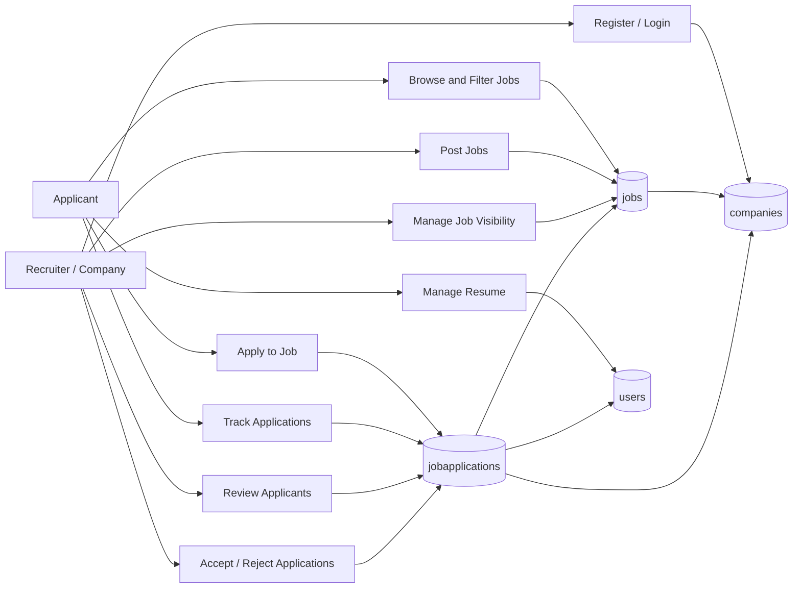

# Software Requirements Specification: TalentSync

## 1. Introduction

### 1.1 Purpose

This Software Requirements Specification (SRS) defines the requirements for **TalentSync**, a MERN stack job portal application. This document covers the current web application release represented by the source code in this repository, including the React applicant/recruiter frontend, Express API backend, MongoDB persistence layer, third-party authentication, and file upload integrations.

The product scope covered by this SRS includes:

- Public job discovery and job detail browsing.
- Applicant authentication, resume upload, job application submission, and application tracking.
- Recruiter/company registration, login, job posting, job visibility management, candidate review, and application status management.
- Backend APIs, MongoDB collections, and third-party service integrations required to support the above workflows.

This SRS does not cover native mobile applications, payment processing, advanced recruiter analytics, AI matching, interview scheduling, or external applicant tracking system integrations unless explicitly added in a later release.

### 1.2 Document Conventions

This document uses the following conventions:

- **TalentSync** refers to the complete software product.
- **Applicant** refers to a job seeker using the public job portal and authenticated application features.
- **Recruiter** or **Company** refers to an employer account that can post jobs and manage applicants.
- **System** refers to the TalentSync frontend, backend, database, and integrations acting together.
- Requirement keywords use standard meanings:
  - **Must** means the requirement is mandatory for the release.
  - **Should** means the requirement is expected but may be adjusted with product approval.
  - **May** means the requirement is optional or future-facing.
- Requirement priorities are stated explicitly where applicable:
  - **P0**: Required for core product operation.
  - **P1**: Important for a complete user workflow.
  - **P2**: Useful enhancement or quality improvement.
- Detailed requirements inherit the priority of their parent section unless a different priority is stated.
- API paths, database collections, environment variables, and file paths are formatted as inline code.

### 1.3 Intended Audience and Reading Suggestions

This SRS is intended for:

- **Product managers** who need a clear definition of current product scope, supported workflows, and release boundaries.
- **Developers** who need implementation context for frontend, backend, database, authentication, and integration behavior.
- **QA/testers** who need to derive test cases from expected product functions and user workflows.
- **Designers** who need to understand the main user roles, screens, and interaction expectations.
- **Project stakeholders** who need a high-level view of what TalentSync does and which capabilities are included in the current release.
- **Documentation writers** who need product behavior and terminology for user-facing guides.

Recommended reading sequence:

1. Read **Introduction** to understand product purpose, scope, and document conventions.
2. Read **Product Scope** to understand the business objective and user value.
3. Read **Product Functions** to understand major capabilities by user role.
4. Developers and QA should then review the source references, API routes, MongoDB models, and user workflows identified in this document.

### 1.4 Product Scope

TalentSync is a job portal that connects applicants with recruiters through a web-based hiring marketplace. Applicants can browse active jobs, filter opportunities, view detailed job descriptions, upload resumes, apply to jobs, and track application outcomes. Recruiters can register company accounts, post job openings, control listing visibility, view candidates, access applicant resumes, and accept or reject applications.

The product supports the following business goals:

- Reduce friction for applicants searching and applying for job opportunities.
- Give recruiters a simple dashboard to publish openings and manage candidate pipelines.
- Centralize job, company, applicant, and application data in MongoDB.
- Use third-party services for authentication and media storage to accelerate delivery and reduce operational complexity.

The current implementation is suitable for a hackathon/MVP-grade job portal and establishes a foundation for future enhancements such as richer company profiles, notification workflows, recruiter analytics, candidate matching, and enterprise moderation.

### 1.5 References

The following references were used to prepare this SRS:

| Reference | Source / Location | Notes |
| --- | --- | --- |
| Project README | `README.md` | Product overview, features, setup, environment variables, tech stack. |
| Frontend routes | `client/src/App.jsx` | Defines applicant and recruiter page routing. |
| Application context | `client/src/context/AppContext.jsx` | Defines shared frontend state, API calls, authentication token usage, and stored company session behavior. |
| Applicant pages | `client/src/pages/Home.jsx`, `client/src/pages/ApplyJob.jsx`, `client/src/pages/Applications.jsx` | Defines job discovery, job application, resume upload, and application tracking workflows. |
| Recruiter pages | `client/src/pages/Dashboard.jsx`, `client/src/pages/AddJob.jsx`, `client/src/pages/ManageJobs.jsx`, `client/src/pages/ViewApplications.jsx` | Defines recruiter dashboard, job posting, job management, and candidate review workflows. |
| Backend server | `server/server.js` | Defines Express application setup and mounted API routes. |
| Job routes | `server/routes/jobRoutes.js` | Defines public job listing and job detail endpoints. |
| User routes | `server/routes/userRoutes.js` | Defines applicant profile, resume, application submission, and application history endpoints. |
| Company routes | `server/routes/companyRoutes.js` | Defines recruiter registration, login, job posting, job listing, visibility, applicant review, and status update endpoints. |
| MongoDB models | `server/models/User.js`, `server/models/Company.js`, `server/models/Job.js`, `server/models/JobApplication.js` | Defines persisted data schemas and relationships. |
| Database configuration | `server/config/db.js` | Defines MongoDB connection target database `job-portal`. |
| Clerk webhook handler | `server/controller/webhooks.js` | Defines user creation, update, and deletion behavior from Clerk events. |
| Cloudinary configuration | `server/config/cloudinary.js` | Supports uploaded company images and applicant resumes. |

## 2. Product Functions

TalentSync must provide the following major product functions.

### 2.1 Applicant Functions

- Browse active job listings on the homepage.
- Search jobs by title and location.
- Filter jobs by category and location.
- View paginated job results.
- View detailed job information, including title, company, location, level, salary, posting date, and rich job description.
- View similar jobs based on company or category.
- Sign in through Clerk before accessing authenticated applicant actions.
- Maintain applicant profile data synchronized from Clerk.
- Upload or update a PDF resume.
- View the uploaded resume.
- Apply to a job only when authenticated and when a resume is available.
- Prevent duplicate applications to the same job.
- View submitted job applications.
- Track application status as pending, accepted, or rejected.
- Filter application dashboard records by status.

### 2.2 Recruiter / Company Functions

- Register a company account with name, email, password, and company logo.
- Store recruiter passwords as bcrypt hashes.
- Log in using company email and password.
- Persist recruiter session token in the browser.
- View recruiter dashboard after authentication.
- Post a new job with title, rich description, location, category, experience level, and salary.
- Preview job details before posting.
- View all jobs posted by the authenticated company.
- See job management metrics, including total jobs, active jobs, and total applicants.
- Toggle job visibility between active and hidden.
- View candidate applications for company jobs.
- Search applicants by applicant name, job title, or job location.
- Filter applications by all, pending, accepted, or rejected.
- Open applicant resumes.
- Change application status to accepted or rejected.
- Log out and clear recruiter session data.

### 2.3 Public Job Functions

- Display only jobs where `visible` is `true` on public listings.
- Display individual job detail pages by job ID.
- Populate company information on job listings and job detail pages without exposing company passwords.

### 2.4 Authentication and Authorization Functions

- Use Clerk authentication for applicant identity.
- Use Clerk webhooks to create, update, and delete applicant records in MongoDB.
- Use JWT tokens for recruiter/company authentication.
- Protect recruiter APIs with company token validation.
- Require applicant bearer tokens for applicant-specific APIs such as profile retrieval, resume upload, application submission, and application history.

### 2.5 File Upload and Media Functions

- Upload company logos through the recruiter registration flow.
- Upload applicant resumes through the applicant dashboard.
- Store uploaded file URLs from Cloudinary in MongoDB.
- Restrict applicant resume selection in the UI to PDF files.

### 2.6 Data Management Functions

- Store data in MongoDB database `job-portal`.
- Maintain the following core collections:
  - `users`
  - `companies`
  - `jobs`
  - `jobapplications`
- Maintain relationships:
  - A job belongs to one company through `companyId`.
  - A job application belongs to one user, one company, and one job through `userId`, `companyId`, and `jobId`.
- Populate related company, job, and user fields when returning application and job data to the frontend.

### 2.7 External Integrations

- Integrate with Clerk for applicant authentication and user lifecycle webhooks.
- Integrate with Cloudinary for uploaded images and resumes.
- Integrate with MongoDB through Mongoose.
- Support Sentry configuration for error monitoring as described in project setup.

### 2.8 High-Level Functional Model

### 2.9 Major API Groups

| API Group | Main Purpose | Representative Endpoints |
| --- | --- | --- |
| Jobs | Public job discovery and job detail retrieval | `GET /api/jobs`, `GET /api/jobs/:id` |
| Users | Applicant profile, resume, applications, and apply workflow | `GET /api/users/user`, `POST /api/users/apply`, `GET /api/users/applications`, `POST /api/users/update-resume` |
| Company | Recruiter authentication, job posting, job management, and applicant review | `POST /api/company/register`, `POST /api/company/login`, `POST /api/company/post-job`, `GET /api/company/list-jobs`, `GET /api/company/applicants`, `POST /api/company/change-status`, `POST /api/company/change-visibility` |
| Webhooks | Clerk user lifecycle synchronization | Clerk webhook endpoint mounted by backend server |

